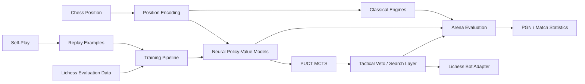
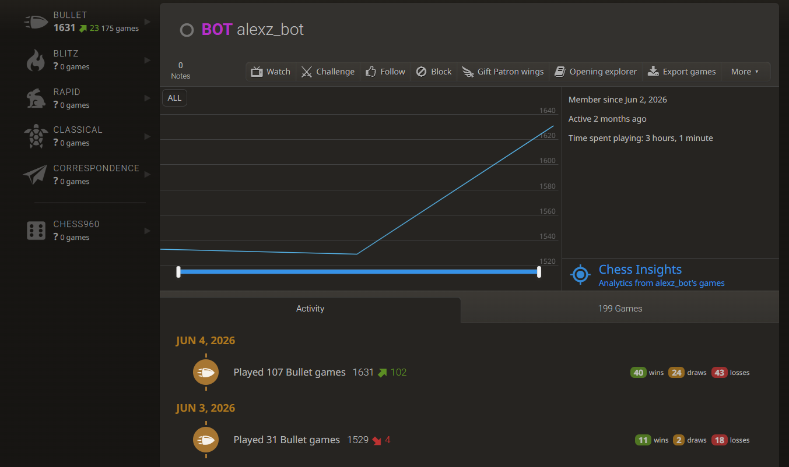

# Chess Engine Research Framework

A modular Python research framework for comparing classical search, Monte Carlo Tree Search (MCTS), and neural policy-value chess engines through shared interfaces, self-play, training, and automated arena evaluation.

The codebase uses `python-chess` for board state and legal move generation and PyTorch for neural models. The public snapshot includes classical baselines, negamax/alpha-beta search, PUCT MCTS, CNN and Transformer policy-value models, self-play tooling, Lichess-evaluation training utilities, a Streamlit/CLI interface, and a Lichess bot adapter.

> **Public-repo note:** model checkpoints, training datasets, caches, generated artifacts, account credentials, and other environment-specific files are intentionally excluded.

## Highlights

- Shared `BaseEngine` interface for interchangeable engine implementations
- Classical baselines: random, material, tactical, and minimax
- Negamax minimax with alpha-beta pruning
- PUCT Monte Carlo Tree Search with policy priors and neural value evaluation
- Batched leaf evaluation, evaluation caching, optional time budgets, and root exploration noise
- Optional tactical-veto layer on top of MCTS
- Transformer policy-value network with chess-state metadata embeddings
- AlphaZero-style residual CNN policy-value network
- 4,544-action UCI move vocabulary with legal-move masking
- Self-play game recording and replay-dataset generation
- Policy/value training losses and checkpoint utilities
- Automated engine-vs-engine arena with PGN output
- Lichess evaluation-stream training utilities
- Lichess bot integration adapter
- CLI and Streamlit interfaces

## Architecture



See [`docs/architecture.md`](docs/architecture.md) for more detail.

## Engine Families

### Classical baselines

`RandomEngine`, `MaterialEngine`, and `TacticalEngine` provide lightweight comparison baselines for experiments and arena matches.

### Minimax

`MinimaxEngine` implements negamax with alpha-beta pruning. Its static evaluation combines material balance with a mobility term, providing a deterministic classical-search baseline.

### Neural policy engine

`NeuralEngine` evaluates the current position with a trained policy-value model, masks illegal actions, and selects from the legal policy distribution.

### Neural search

`NeuralSearchEngine` adds shallow candidate/reply search around neural policy and value estimates.

### MCTS

`MCTSEngine` wraps a PUCT MCTS implementation using neural policy priors and value estimates. The implementation supports:

- fixed simulation budgets or time budgets
- Dirichlet root exploration noise
- temperature-based move selection
- batched leaf evaluation
- configurable child pruning
- position-evaluation caching
- optional tactical-veto checks

## Neural Models

### Transformer

The default Transformer configuration uses:

- 192-dimensional embeddings
- 4 Transformer encoder layers
- 6 attention heads
- 768-dimensional feed-forward layers
- 0.1 dropout

The input representation includes 64 board-square tokens plus side-to-move, castling-rights, and en-passant metadata. A learned classification token feeds the policy, value, and auxiliary prediction heads.

### Residual CNN

The CNN path uses an AlphaZero-style residual architecture with:

- 128 channels
- 6 residual blocks
- dedicated policy and value heads
- the same chess-state metadata and output interface as the Transformer

Because both architectures implement the same policy-value interface, training and engine code can switch model families through the model factory.

## Move Representation

The action space is generated from UCI source/destination square pairs plus promotion variants. It contains 4,544 actions. At inference time, logits are masked against the position's legal moves before move selection or MCTS expansion.

## Repository Structure

```text
chess-engine-research-framework/
├── README.md
├── pyproject.toml
├── requirements.txt
├── images/
│   └── lichess-profile.png
├── docs/
│   ├── architecture.md
│   ├── training.md
│   └── public-release.md
├── src/minizero/
│   ├── agents/          # random/material move-selection helpers
│   ├── chess/           # board encoding and UCI move vocabulary
│   ├── engine/          # engine implementations
│   ├── eval/            # arena and PGN evaluation
│   ├── integrations/    # Lichess adapter
│   ├── interfaces/      # CLI and Streamlit interfaces
│   ├── models/          # Transformer/CNN policy-value networks
│   ├── search/          # PUCT MCTS, nodes, tactical veto
│   ├── selfplay/        # game records and self-play workers
│   ├── train/           # datasets and losses
│   └── utils/           # checkpoint helpers
├── scripts/
│   ├── run_arena.py
│   ├── benchmark_mcts.py
│   ├── generate_mcts_selfplay.py
│   ├── generate_mcts_vs_engine.py
│   ├── train_iterative_mcts_selfplay.py
│   └── train_lichess_eval_stream.py
└── tests/
    ├── test_minimax_engine.py
    ├── test_mcts_engine.py
    ├── test_neural_search_engine.py
    ├── test_cnn_policy_value.py
    ├── test_transformer_policy_value.py
    ├── test_arena.py
    └── test_lichess_bot_adapter.py
```

## Installation

```bash
python -m venv .venv
source .venv/bin/activate       # Windows: .venv\Scripts\activate
pip install -e ".[dev,ui,training]"
```

For only the core engine/model code:

```bash
pip install -e .
```

## Examples

### Run an arena match

```bash
python scripts/run_arena.py \
  --white minimax \
  --black material \
  --games 20
```

### Benchmark MCTS

```bash
python scripts/benchmark_mcts.py --help
```

### Generate MCTS self-play data

```bash
python scripts/generate_mcts_selfplay.py --help
```

### Train from a Lichess evaluation stream

```bash
python scripts/train_lichess_eval_stream.py --help
```

The training script accepts an external evaluation dataset path and supports both Transformer and CNN model configurations, checkpointing, mixed precision, and configurable policy/value/auxiliary loss weights.

## Evaluation

The arena module runs engine-vs-engine games, records PGNs, tracks wins/draws/termination modes, supports custom opening FENs, and can optionally adjudicate unfinished games by material after a maximum ply count.

## Lichess Deployment

The engine was integrated with Lichess and deployed as the autonomous bot account `alexz_bot`.

The bot played live rated games using the engine integration included in this repository and reached a **1631 Bullet rating** across 175 Bullet games.



The deployment layer is implemented in `src/minizero/integrations/lichess_bot_adapter.py`, which adapts the neural engine family to a Lichess-bot style move-selection interface and supports restricted root-move sets supplied by opening books or tablebases.

Authentication credentials, private account configuration, and deployment secrets are **not** included in this repository.

## Tests

The included tests cover representative engine, MCTS, model, arena, and Lichess-adapter behavior.

```bash
pytest
```

## Public Snapshot

This repository is intentionally curated for source-code review. Large datasets, model checkpoints, local caches, generated PGNs, and environment/account configuration are excluded. Experimental model variants that are not part of this snapshot are also omitted.
